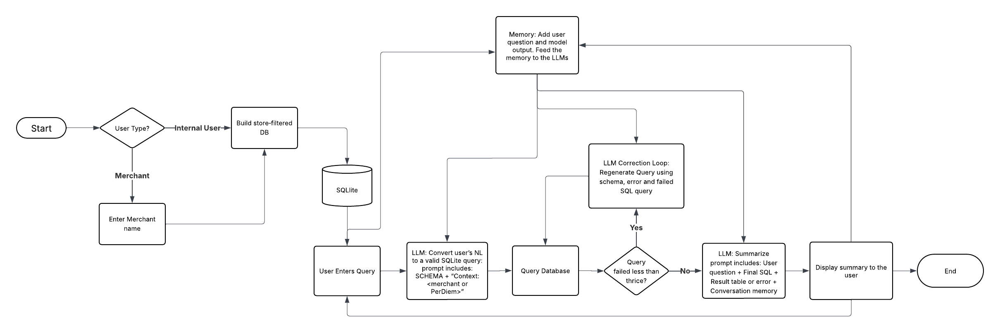

# Per Diem DataQuery Chatbot

A Python-based chatbot allowing both Per Diem internal users and merchant users to interactively query sales and revenue data stored in a SQLite database. Users ask natural-language questions, which are converted into SQLite queries by an LLM, executed against a filtered (or full) dataset, and summarized back in plain English. A Streamlit frontend enables easy deployment and real-time interaction.

Application: https://dataquerybot-perdiem.streamlit.app/

---

## Table of Contents

1. [Features](#features)  
2. [Prerequisites](#prerequisites)  
3. [Repository Structure](#repository-structure)  
4. [Installation](#installation)  
5. [Data Preprocessing](#data-preprocessing)  
6. [Database Generation](#database-generation)  
7. [Running the Console Chatbot](#running-the-console-chatbot)  
8. [Running the Streamlit App](#running-the-streamlit-app)  
9. [Environment Variables](#environment-variables)  
10. [Examples](#examples)  
11. [Architecture](#architecture)
12. [DockerFile Run](#docker)

---

## Features

- **Natural-Language to SQL**  
  Uses an LLM (via the `groq` client) to convert user questions into valid SQLite queries, strictly following the schema of the `orders`, `customers`, and `stores` tables.

- **Contextual Memory**  
  Employs a `ConversationBufferMemory` (via LangChain) to maintain conversation context during a single session, allowing follow-up questions to rely on previous exchanges.

- **User Modes**  
  - **Per Diem Internal User**: Access to the full dataset across all stores.  
  - **Merchant**: Access limited to a single store’s data. When a merchant is chosen, the backend filters the database to include only that merchant’s records, ensuring no other store data is visible.

- **Streamlit Frontend**  
  A responsive web interface where users select their role (internal vs. merchant), optionally select their merchant from a dropdown, and then engage in a chat window to ask questions and view results in markdown tables.

- **Data Preprocessing Pipeline**  
  A reusable `DataPreprocessor` class in `preprocess.py` that:  
  1. Replaces problematic commas inside JSON-like fields in raw CSV files.  
  2. Re-assembles cleaned CSV files (`cleaned_orders.csv`, `cleaned_customers.csv`, `cleaned_stores.csv`).  
  3. Loads cleaned data into a SQLite database (`dashboard_chatbot.db`).  

---

## Prerequisites

- Python 3.8 or higher  
- Git  
- pip
- Groq API key to run locally

---

## Repository Structure

```
DataQueryBot/
├── README.md
├── app.py
├── main.py
├── preprocess.py
├── requirements.txt
├── Raw/
│   ├── orders_.csv
│   ├── customers_.csv
│   └── stores.csv
├── Processed/
│   ├── fixed_orders_*.csv
│   ├── fixed_customers_*.csv
│   ├── fixed_stores_*.csv
│   ├── cleaned_orders.csv
│   ├── cleaned_customers.csv
│   ├── cleaned_stores.csv
│   └── dashboard_chatbot.db
├── .gitignore
└── .env.example
```

---

## Installation

```bash
git clone https://github.com/your-username/DataQueryBot.git
cd DataQueryBot
python3 -m venv venv
source venv/bin/activate
pip install --upgrade pip
pip install -r requirements.txt
cp .env.example .env
```

---

## Data Preprocessing

Please make sure to add your stores, customers and orders CSV files to the Raw folder. 

The data is preprocessed using the preprocess.py file as follows, 
```bash
python preprocess.py
```


---

## Database Generation

After running the preprocessor, you'll get the following in the Processed folder:
- Cleaned CSVs
- SQLite database with `orders`, `customers`, and `stores` tables

---

## Running the Console Chatbot

```bash
python main.py
```

Set your `.env`:
```
GROQ_KEY=your_key
MERCHANT_NAME=""
IS_PER_DIEM=True
```

---

## Running the Streamlit App

Please make sure to set the Groq API key in your env file

```bash
streamlit run app.py
```

---

## Environment Variables

- `GROQ_KEY`  
- `MERCHANT_NAME`  
- `IS_PER_DIEM`

---

## Examples

### Internal User
You: Total revenue in march 2025?

Assistant:

Here is the answer:

The total revenue in March 2025 is $1,326,770.09.


### Merchant (Tikka Shack)
You: total revenue in march 2025?

Assistant:

Here is the result:

| total_revenue_in_dollars |
|--------------------------|
| 78020.08                 |

Insights: The total revenue in March 2025 for Tikka Shack is $78,020.08.

Since this is a significant revenue, a potential opportunity is to increase sales further. A marketing promotion could be: "Offer a 10% discount on all orders above $100 in April 2025 to maintain the sales momentum."

---


## Architecture

## Flowchart



### System Flow: Per Diem DataQuery Chatbot

This flowchart outlines the step-by-step lifecycle of a user query in the Per Diem DataQuery chatbot.

1. **User Selection**  
   The user selects whether they are a PerDiem internal user or a merchant. If they choose merchant, they also provide a store name.

2. **Database Initialization**  
   - Internal users connect to the full SQLite database.  
   - Merchant users receive a filtered database containing only their store’s data.

3. **User Query**  
   The user enters a natural language question through the interface.

4. **LLM SQL Generation**  
   The question is passed to a large language model (LLM), which generates a valid SQLite query. The prompt includes instructions to follow, the schema, conversation memory, and a context string indicating whether the user is internal or a merchant.

5. **Query Execution**  
   The generated SQL is run against the appropriate database.

6. **Error Handling**  
   - If the query fails, a correction loop is triggered.  
   - The failed SQL, error message, and context are sent back to the LLM to regenerate a corrected query.  
   - This process is retried up to three times.

7. **Result Summarization**  
   Once the query succeeds (or permanently fails), the result is summarized by the LLM. The prompt includes the instructions to follow, original question, the final SQL, the result or error, and the memory of previous turns.

8. **Response & Memory Update**  
   - The summary is displayed to the user.  
   - The user’s question and the assistant’s response are saved to memory for improved context in future questions.

This architecture allows users to interact with structured business data through natural language, while ensuring accuracy and context-awareness.

---

## Docker

1. **Build the Docker image** (from project root, where `Dockerfile` lives):  
   ```bash
   docker build -t dataquerybot:latest .
   ```
2. Run container locally, forwarding port 8501 and loading environment vars:
   
   Please make sure to set the Groq API key in your env file

   ```bash
   docker run -d \ -p 8501:8501 \ --env-file .env \ --name dataquerybot \ dataquerybot:latest```
4. Verify and visit http://localhost:8501 in your browser.

